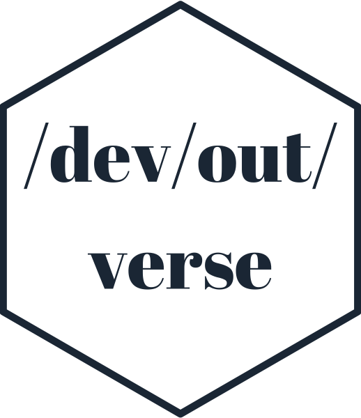
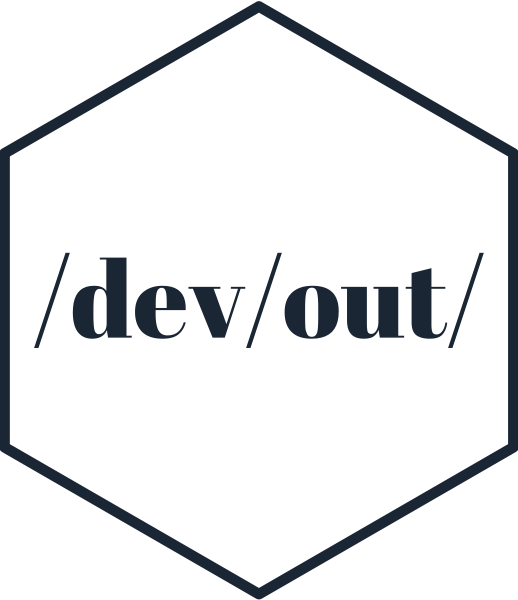
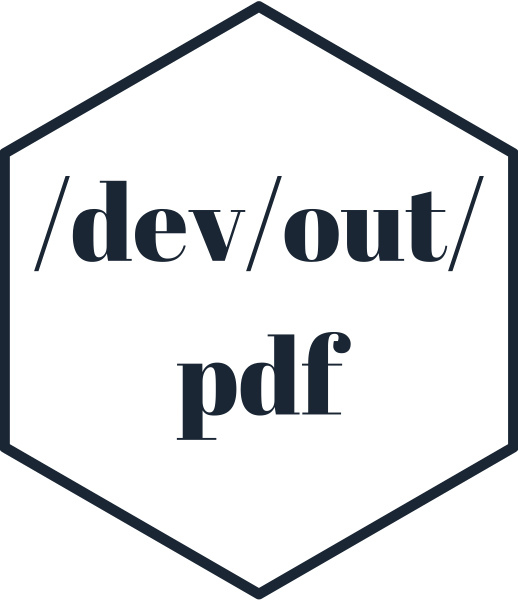
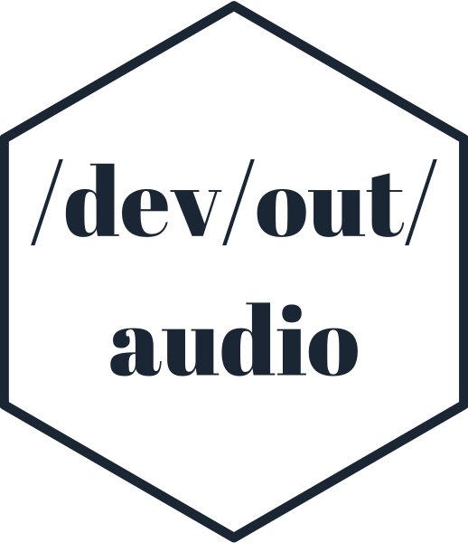
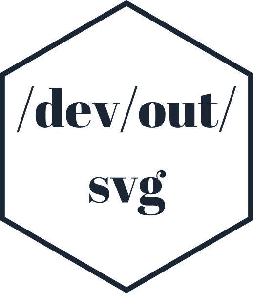
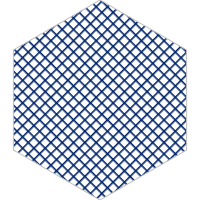
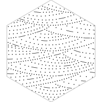
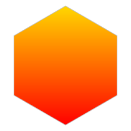

<!-- README.md is generated from README.Rmd. Please edit that file -->

```{r, include = FALSE}
knitr::opts_chunk$set(
  collapse = TRUE,
  comment = "#>",
  fig.path = "man/figures/README-",
  out.width = "100%"
)
```


```{r echo = FALSE, eval = FALSE}
# Quick logo generation. Borrowed heavily from Nick Tierney's Syn logo process
library(magick)
library(showtext)
font_add_google("Abril Fatface", "gf")


# pkgdown::build_site(override = list(destination = "../coolbutuseless.github.io/package/devoutverse"))
```


```{r echo = FALSE, eval = FALSE}
img <- image_read("man/figures/white.png") 


hexSticker::sticker(subplot  = img,
                    s_x      = 0.92,
                    s_y      = 1.2,
                    s_width  = 1.5,
                    s_height = 0.95,
                    package  = "/dev/out/\nverse",
                    p_x      = 1,
                    p_y      = 1,
                    p_color  = "#223344",
                    p_family = "gf",
                    p_size   = 9,
                    h_size   = 1.2,
                    h_fill   = "#ffffff",
                    h_color  = "#223344",
                    filename = "man/figures/logo.png")

image_read("man/figures/logo.png")
```


# devoutverse   

<!-- badges: start -->


<!-- badges: end -->

The `devoutverse` is a collection of packages offering non-standard devices for RStats.
Most are based on [`devout`](https://github.com/coolbutuseless/devout).

The purpose of this `devoutverse` package is to:

1. Provide links to the various packages.


## Installation

You can install `devoutverse` packages from [GitHub](https://github.com/coolbutuseless/) with:

``` r
# install.packages("devtools")
devtools::install_github("coolbutuseless/devout")
devtools::install_github("coolbutuseless/devoutpdf")
devtools::install_github("coolbutuseless/devoutaudio")
devtools::install_github("coolbutuseless/devoutsvg")
```

<br />


|    |           |  |
|----------------------|--------------------|--------------------------|
| <br/> ASCII graphics device<br/><a href="http://github.com/coolbutuseless/devout">Github</a><br/> <a href="http://coolbutuseless.github.io/package/devout">Online documentation</a> |  <br/>PDF device<br/><a href="http://github.com/coolbutuseless/devoutpdf">Github</a><br/> <a href="http://coolbutuseless.github.io/package/devoutpdf">Online documentation</a> | <br/> Audio output for graphics device<br/><a href="http://github.com/coolbutuseless/devoutaudio">Github</a><br/> <a href="http://coolbutuseless.github.io/package/devoutaudio">Online documentation</a> | 
| <br/> SVG graphics device with pattern support <br/><a href="http://github.com/coolbutuseless/devoutsvg">Github</a><br/> <a href="http://coolbutuseless.github.io/package/devoutsvg">Online documentation</a> | | |


## Helpers for `devoutsvg`

The following packages provide SVG support for use with `minisvg` and `devoutsvg`


|    |           |  |
|----------------------|--------------------|--------------------------|
| <br/> Simple SVG patterns<br/><a href="http://github.com/coolbutuseless/svgpatternsimple">Github</a><br/> <a href="http://coolbutuseless.github.io/package/svgpatternsimple">Online documentation</a> |  <br/>USGS Patterns<br/><a href="http://github.com/coolbutuseless/svgpatternusgs">Github</a><br/> <a href="http://coolbutuseless.github.io/package/svgpatternusgs">Online documentation</a> | <br/> SVG animation helpers<br/><a href="http://github.com/coolbutuseless/svganim">Github</a><br/> <a href="http://coolbutuseless.github.io/package/svganim">Online documentation</a> | 
| <br/> SVG filters <br/><a href="http://github.com/coolbutuseless/svgfilter">Github</a><br/> <a href="http://coolbutuseless.github.io/package/svgfilter">Online documentation</a> | | |


## Want to build your own device?

Best starting point is to read the [vignettes for the `devout` package](https://coolbutuseless.github.io/package/devout/articles/creating-an-svg-device-01.html) 
which steps through the process of building a simple SVG graphics output device.


