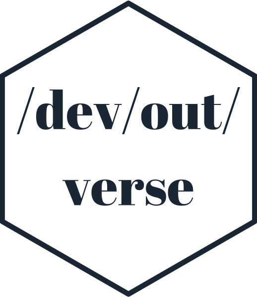

<!-- README.md is generated from README.Rmd. Please edit that file -->

# devoutverse 

<!-- badges: start -->


<!-- badges: end -->

The `devoutverse` is a collection of packages offering non-standard
devices for RStats. Most are based on
[`devout`](https://github.com/coolbutuseless/devout).

The purpose of this `devoutverse` package is to:

1.  Provide links to the various packages.

## Installation

You can install `devoutverse` packages from
[GitHub](https://github.com/coolbutuseless/) with:

``` r
# install.packages("devtools")
devtools::install_github("coolbutuseless/devout")
devtools::install_github("coolbutuseless/devoutpdf")
devtools::install_github("coolbutuseless/devoutaudio")
```

<br />

|                                                                                                                                                                                                                           |                                                                                                                                                                                                                         |                                                                                                                                                                                                                                                     |
| ------------------------------------------------------------------------------------------------------------------------------------------------------------------------------------------------------------------------- | ----------------------------------------------------------------------------------------------------------------------------------------------------------------------------------------------------------------------- | --------------------------------------------------------------------------------------------------------------------------------------------------------------------------------------------------------------------------------------------------- |
| <br/> ASCII graphics device<br/><a href="http://github.com/coolbutuseless/devout">Github</a><br/> <a href="http://coolbutuseless.github.io/package/devout">Online documentation</a> |  <br/>PDF device<br/><a href="http://github.com/coolbutuseless/devoutpdf">Github</a><br/> <a href="http://coolbutuseless.github.io/package/devoutpdf">Online documentation</a> | <br/> Audio output for graphics device<br/><a href="http://github.com/coolbutuseless/devoutaudio">Github</a><br/> <a href="http://coolbutuseless.github.io/package/devoutaudio">Online documentation</a> |

## Want to build your own device?

Best starting point is to read the [vignettes for the `devout`
package](https://coolbutuseless.github.io/package/devout/articles/creating-an-svg-device-01.html)
which steps through the process of building a simple SVG graphics output
device.
